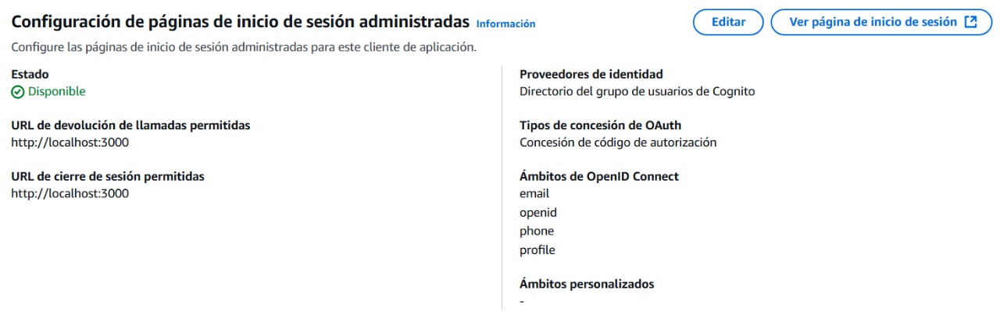

# 🧩 Backend – Spring Boot + AWS Lambda

## 📌 Proyecto: API Experimental estilo Twitter

**Autores:**  
- David Espinosa  
- Emily Noreña  

---

### 🧠 Descripción general
Este proyecto implementa una API REST monolítica en **Spring Boot** que permite a los usuarios realizar publicaciones (posts) de hasta **140 caracteres** y almacenarlos en un **stream global**, similar a Twitter.  
Posteriormente, el monolito se divide en **microservicios** y se despliega en **AWS Lambda**, integrando seguridad mediante **JWT** y **Amazon Cognito**.

---

### ⚙️ Tecnologías utilizadas
- **Spring Boot 3.x**
- **Java 17**
- **MongoDB / DynamoDB**
- **JWT Security**
- **AWS Lambda**
- **AWS API Gateway**
- **AWS S3**
- **AWS Cognito**
- **Maven**

---

### 🧩 Entidades principales
- **User:** representa un usuario registrado.
- **Post:** publicación individual de hasta 140 caracteres.
- **Stream:** flujo general de publicaciones.

---

### 🚀 Despliegue del monolito en EC2
```bash
ssh -i "key.pem" ec2-user@<ec2-public-ip>
scp -i "key.pem" target/twitter-api.jar ec2-user@<ec2-public-ip>:/home/ec2-user/
java -jar twitter-api.jar
```
La API estará disponible en:
```
http://<ec2-public-ip>:8080
```

---

### 🧬 Migración a AWS Lambda
1. Crear función Lambda desde consola → **Author from scratch**
2. Subir el `.jar` empaquetado.
3. Configurar el *handler*:
   ```
   com.example.twitter.StreamApplication::handleRequest
   ```
4. Asignar memoria: **1024 MB**  
   Timeout: **30 segundos**
5. Crear endpoint con **API Gateway**.

---

### 🔐 Seguridad con JWT y AWS Cognito
*(Espacio para pantallazo del Cognito y endpoints seguros)*  




---

### 🧾 Ejemplos de endpoints
| Método | Ruta | Descripción |
|--------|------|-------------|
| `POST` | `/api/users/register` | Crear usuario |
| `POST` | `/api/posts` | Crear post |
| `GET` | `/api/stream` | Obtener posts |


---


### 📚 Bibliografía
- Spring Boot Documentation – https://spring.io/projects/spring-boot  
- AWS Lambda Java – https://docs.aws.amazon.com/lambda/latest/dg/java-handler.html  
- AWS Cognito – https://docs.aws.amazon.com/cognito/
